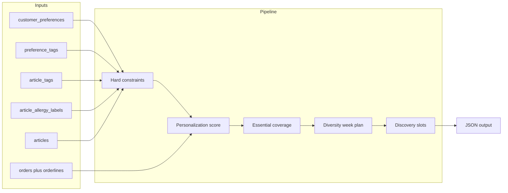

# Weekly shopping-basket recommender

## Goals


| Goal            | Approach                                                                                                                                                                                                          |
| --------------- | ----------------------------------------------------------------------------------------------------------------------------------------------------------------------------------------------------------------- |
| **Stickiness**  | Favor SKUs the customer already buys (`log(1 + order_qty)`), plus preferred diet tags and better Nutri-Score.                                                                                                     |
| **Coverage**    | Six **essential buckets** (bakery, vegetables, fruits, dairy or plant alternative, protein, pantry/condiments) with one pick each when the catalog allows.                                                        |
| **Diversity**   | Seven-day plan with a fixed rotation of **focus categories**; up to two items per day, at most one per category per day.                                                                                          |
| **Novelty**     | Up to **K** “discovery” lines chosen from eligible SKUs with **no or negligible** prior orders, still ranked by the same score (without an extra novelty bonus in the current implementation—see code constants). |
| **Context**     | Hard filters from `customer_preferences`, `article_tags`, `article_allergy_labels`, and category rules (lactose, nuts, vegan, etc.).                                                                              |
| **Time trends** | Optional boosts from dated orders (weekday, month-end, biweekly parity), anchored to `reference_date`.                                                                                                            |


## Data sources

- `**customer_preferences`** + `**preference_tags**`: `required` / `avoid` / `prefer` per tag.
- `**article_tags**`: product compliance with diet/religious tags (e.g. halal, vegan).
- `**article_allergy_labels**`: structured allergens (e.g. `milk`, `tree_nuts`, `gluten`).
- `**articles**`: category, price, Nutri-Score, availability (household items excluded from the default food basket unless temporal rules allow—see below).
- `**orders` / `orderlines**`: per-line quantities **and** `orders.creation_date` (UTC) for lifetime totals, novelty, and **temporal** boosts.
- `**customers.household_size`**: scales quantities for produce-heavy lines.

Rebuild the database after changing CSVs:

```bash
uv run python scripts/build_sqlite_db.py
```

## Pipeline




### 1. Hard constraints

1. **Tag rules** (same spirit as `GET /api/recommendations`): every `required` tag must appear on the article; no `avoid` tag id may appear on the article (for tags that are also used as product labels).
2. **Dietary / allergy rules** (by preference **code**, not only tag intersection):
  - **Lactose intolerance** (`avoid`): exclude **Dairy** category and any SKU with allergy label `milk`.
  - **Nut allergy** (`avoid`): exclude **Nuts & Seeds** category and allergy labels `tree_nuts` / `peanuts`.
  - **Vegetarian** (`required`): exclude **Meat**.
  - **Vegan** (`required`): article must carry the **vegan** tag; exclude **Meat**, **Dairy**, honey (`PAN-HON-001`).
3. **Catalog**: `is_available = 1`; **Household** excluded by default, included when `reference_date` is in the last **K** days of the month and history shows month-end lift for Household (see temporal section).

### 2. Scoring

**Base** score for each eligible article:


\text{score} = w_r \log(1 + q) + w_p |T_{\text{article}} \cap T_{\text{prefer}}| + w_n \phi(\text{Nutri-Score}) - w_\pi \cdot \text{price}


- q: lifetime ordered quantity for that customer.
- \phi: maps A→5 … E→1, “-”→3 (tunable in `[basket_recommender.py](../backend/services/basket_recommender.py)`).
- Constants: `W_REPEAT`, `W_PREFER`, `W_NUTRISCORE`, `W_PRICE` (and optional `W_NOVELTY_BONUS` reserved for future use).

**Temporal bonus** (additive): `W_DOW` × weekday strength when the scheduled **calendar day** matches the dominant purchase weekday; `W_MONTH_END` when SKU month-end share exceeds thresholds and `reference_date` is in the month-end window; `W_BIWEEK` when ISO week parity matches the customer’s dominant parity for that SKU. Essentials use temporal **without** weekday (month-end + biweekly only); the weekly plan uses the **full** bonus per day; discovery uses **base only**.

### 3. Essential buckets

Ordered list of buckets; each picks the **highest-scoring** unused SKU whose **category** belongs to the bucket. If **vegan** is `required`, the dairy bucket uses **Legumes** or **Grains** as a plant-based substitute.

### 4. Seven-day diversity

`DAY_FOCUS` assigns each weekday a label and a small set of **allowed categories**. For each day, greedily add up to two SKUs (highest **base + temporal** first) that match the day’s categories, **without** reusing a category on the same day. Each day includes an ISO `date`. When Household is allowed for month-end, **Wednesday** also lists **Household** so detergents can appear. Vegan customers skip meat/dairy-focused days where needed; nut-avoid skips nut-heavy Sunday picks.

### 5. Discovery

From remaining SKUs, take up to **K** items with `order_qty ≤ NOVELTY_MAX_HISTORY` (default 0), highest score first, excluding SKUs already in essentials or the week plan.

## Dishes (recipes)

`[build_dish_recommendations](../backend/services/basket_recommender.py)` mirrors groceries for **recipes**:

- **Tags**: `recipe_tags` with the same `_passes_tag_rules` as articles (`required` / `avoid` / `prefer`).
- **Ingredients**: each recipe must have **at least one eligible article** per ingredient (same `_article_fully_eligible` checks as groceries). Estimated meal price = sum of **cheapest eligible** article per ingredient × recipe line quantity; Nutri-Score term uses the **average** of chosen articles’ scores.
- **Repeat purchases**: `W_REPEAT * log(1 + n)` where `n` is count of `order_recipes` rows for that customer and recipe (join `orders`).
- **Temporal**: dated events from `order_recipes` + `orders.creation_date`; same `compute_sku_temporal_profiles` / `temporal_bonus` (profile keys are `recipe_id` strings stored in the same profile struct).
- **Weekly plan**: up to **two distinct recipes per day**, **unique** across the seven days; same calendar `date` and labels as the grocery week.
- **Discovery**: recipes with no/low `order_recipes` history, base score only (no temporal in novelty), analogous to grocery discovery.

**Unified entry point**: `build_unified_weekly_recommendations(..., mode="groceries"|"dishes"|"both")` returns `groceries` and/or `dishes` payloads.

## Outputs

`build_weekly_basket_recommendations` returns JSON-serializable data:

- `constraints`: resolved preference codes and tag ids.
- `basket.essential`: bucketed lines with reasons.
- `reference_date`, `week_start`: anchor for the planned week (Monday–Sunday).
- `weekly_plan`: seven entries with `day`, `label`, `date`, `items`.
- `temporal_summary`: global month-end fraction, whether Household was included, event count.
- `basket.discovery`: discovery lines with `order_count_prior`.
- `totals`: rough price sum and line count.

## CLI

```bash
uv run python scripts/recommend_weekly_basket.py <customer_uuid>
uv run python scripts/recommend_weekly_basket.py <customer_uuid> --mode both
uv run python scripts/recommend_weekly_basket.py <customer_uuid> --mode dishes --json
uv run python scripts/recommend_weekly_basket.py <customer_uuid> --date 2026-04-30
uv run python scripts/recommend_weekly_basket.py <customer_uuid> --json
```

- `--mode groceries` (default): same JSON shape as before (articles only).
- `--mode dishes`: recipes only.
- `--mode both`: object with `groceries` and `dishes` keys.

`--date` sets the reference date for the **week** (Monday of that week is the plan start) and for temporal boosts (month-end window, biweekly parity).

## Tests

```bash
uv run python scripts/test_basket_recommender.py
```

## Limitations

- **Sparse tags**: many rules fall back to **category** and **allergy** rows; full fidelity would tag every SKU.
- **Cold start**: new customers have uniform history; discovery dominates.
- **Temporal signals**: need enough dated order lines per SKU (`MIN_SKU_EVENTS`); biweekly fit is a coarse odd/even ISO-week heuristic; order time uses **UTC** from `creation_date` only (no delivery slot).
- **Dish ↔ grocery**: two parallel outputs; combining into one checkout is left to the client. Recipe recommendations use `order_recipes` history; grocery recommendations use `orderlines` history.

## Future API integration

The same `build_weekly_basket_recommendations` function can back a new route (e.g. `GET /api/customers/{id}/weekly-basket`) or extend `GET /api/recommendations` without duplicating logic. The existing recommendations endpoint remains a simple tag ranker; this module adds week structure, coverage, and allergy-aware filtering.